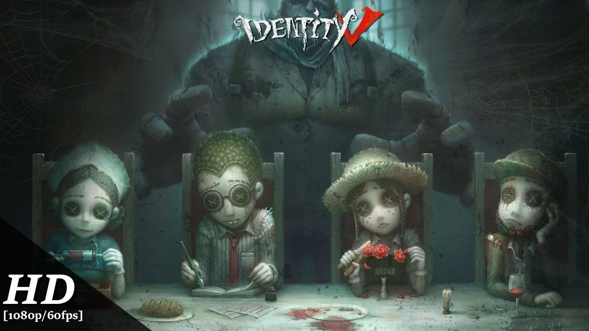
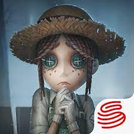
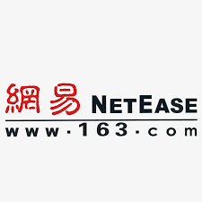
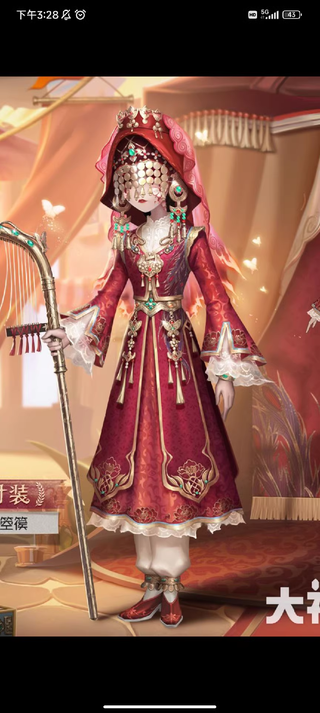
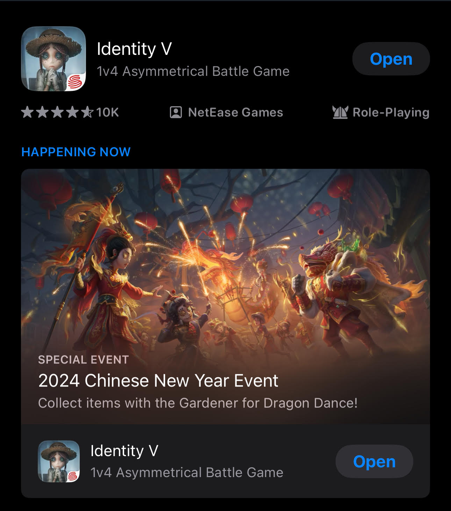
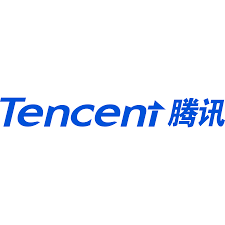
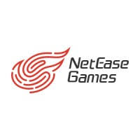

---

marp: true
theme: uncover
class: invert

----

# Identity V

Game produced by NetEast Company

---
<!-- _color: black  -->

**NetEast**
-
<!-- _color: white -->
NetEase is a large Internet technology company in mainland China. Currently, it provides services such as online games, portals, mobile news clients, mobile finance clients, emails, e-commerce, search engines, blogs, photo albums, social platforms, and Internet education.

NetEast is headquartered in Guangdong province, China

---
<!--_backgroundColor: tan-->
<!-- _color: black  -->

**Why do i like IDV**
1. My friends like to play 
2. The game is a 1V4 asymmetric confrontation game, This is my first time play this kind of game and i feel novelty
3. The character setting interesting

---

**Cost**
This game can choose to buy character clothes or you can choose to play the game hard ,save up for the rafffle and get that clothes

----

Search for IDV on apple store and download it

<!--_backgroundColor: tan-->
<!-- _color: black  -->

---

         
Tencent Productions is the competitor of NetEast

Tencent is a Chinese multinational enterprise holding company and the largest Internet company in mainland China.Tencent owns Tencent QQ and WeChat, the most popular social software in mainland China, as well as Tencent Games, the largest online game community. 

----

**3fact**
<!--_backgroundColor: tan-->
<!-- _color: black  -->
1. This game was originally a horror chase game ,but it was changed later ,so the horro element is the teammates.
2.  This game is not friendly to beginners ,it has too many technical terms
3. Identity V planner will hold a lot of activities during each festival,so that players can get rewards
